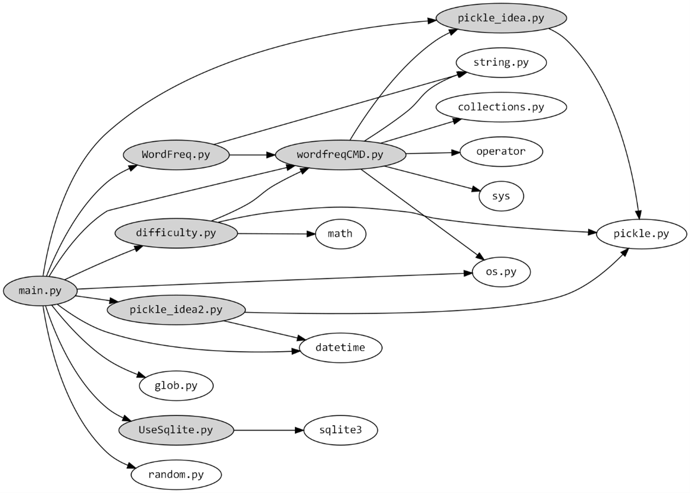
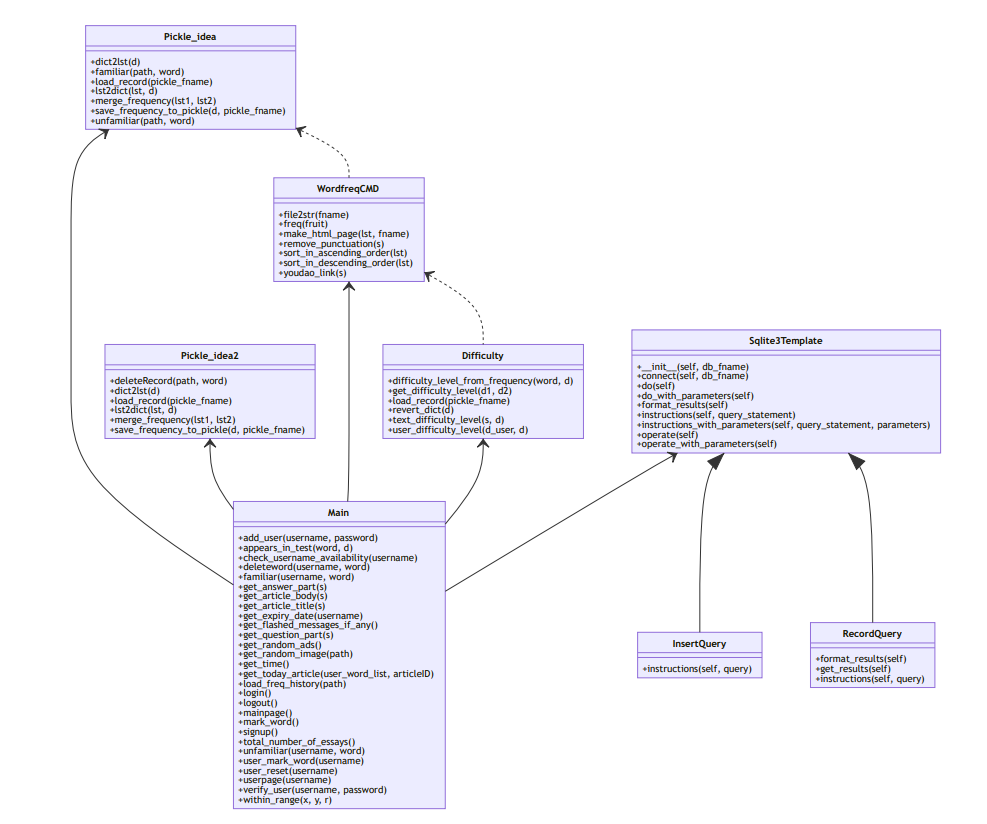

.. EnglishPal documentation master file, created by
   sphinx-quickstart on Sat Nov 27 20:15:28 2021.
   You can adapt this file completely to your liking, but it should at least
   contain the root `toctree` directive.

Welcome to EnglishPal's documentation!
======================================

.. toctree::
   :maxdepth: 2
   :caption: Contents:
   

Indices and tables
==================

* :ref:`genindex`
* :ref:`modindex`
* :ref:`search`

Lab1：Dependency Analysis and Dependency Graph
==============================================

小组成员信息： 201932110143 王炫 201932110145 邬程峰 201932110146 吴彬宇
201932110147 吴雨桐 201932110148 谢铭轩

项目Gitee地址：\ `Gitee <https://gitee.com/dearxuan/EnglishPal.git>`__

项目Read the Docs地址：\ `Read the Docs <https://www.baidu.com>`__

Abstract
--------

借助工具研究EnglishPal现有的模块(或类)之间的依赖关系，了解EnglishPal的架构目前的健康水平，并对当前的架构进行优缺点分析。

Introduction
------------

EnglishPal是一款面向希望提升自身英语阅读能力的用户，提供英语文章学习服务的轻量级在线网站。它内设了多达百篇不同难度等级的文章，会根据用户的英语水平为用户提供相应难度的文章进行练习；同时，每一个用户还享有独立的生词本，用户可以将在阅读文章过程中遇到的生词收集起来，在复习中进行针对性记忆。

本次实验的目的是通过模块和类及函数两个层面对该项目进行依赖分析，判断模块间、类间的耦合程度以及整体架构的健康水平，为之后的系统维护作准备。

Materials and Methods
---------------------

Materials
~~~~~~~~~

1. Snakefood3: 一款使用AST解析python文件并生成依赖关系图的轻量级软件
2. Graphviz 1.6: 一款将结构信息图形可视化的开源软件
3. Mermaid:
   一个将文本和代码转化为图表形式，并实现图表动态地创建修改的工具

Methods
~~~~~~~

1. 利用snakefood3自动生成EnglishPal的模块层间的依赖关系
2. 利用Graphviz，将snakefood生成的文件转化为图表形式可视化呈现
3. 阅读源码，总结出EnglishPal中类及函数之间的依赖关系，再利用Mermaid生成可视化图表

Results
-------

模块层
~~~~~~

snakefood.dot

::

   # This file was generated by snakefood3.

   strict digraph "dependencies" {
       graph [
               rankdir="LR",
               overlap="scale",
               ratio="fill",
               fontsize="16",
               dpi="150",
               clusterrank="local"
           ]
       
          node [
               fontsize=14
               shape=ellipse
               fontname=Consolas
          ];

   "difficulty.py"  [style=filled];
   "difficulty.py" -> "wordfreqCMD.py";
   "difficulty.py" -> "math";
   "difficulty.py" -> "pickle.py";
   "main.py"  [style=filled];
   "main.py" -> "UseSqlite.py";
   "main.py" -> "WordFreq.py";
   "main.py" -> "difficulty.py";
   "main.py" -> "pickle_idea.py";
   "main.py" -> "pickle_idea2.py";
   "main.py" -> "wordfreqCMD.py";
   "main.py" -> "datetime";
   "main.py" -> "glob.py";
   "main.py" -> "os.py";
   "main.py" -> "random.py";
   "pickle_idea.py"  [style=filled];
   "pickle_idea.py" -> "pickle.py";
   "pickle_idea2.py"  [style=filled];
   "pickle_idea2.py" -> "datetime";
   "pickle_idea2.py" -> "pickle.py";
   "UseSqlite.py"  [style=filled];
   "UseSqlite.py" -> "sqlite3";
   "WordFreq.py"  [style=filled];
   "WordFreq.py" -> "wordfreqCMD.py";
   "WordFreq.py" -> "string.py";
   "wordfreqCMD.py"  [style=filled];
   "wordfreqCMD.py" -> "pickle_idea.py";
   "wordfreqCMD.py" -> "collections.py";
   "wordfreqCMD.py" -> "operator";
   "wordfreqCMD.py" -> "os.py";
   "wordfreqCMD.py" -> "string.py";
   "wordfreqCMD.py" -> "sys";
   }

依赖图（graphviz生成）
~~~~~~~~~~~~~~~~~~~~~~

|图片1|

类/函数层
~~~~~~~~~

metmaid.txt

::

   mermaid
   classDiagram

   Pickle_idea <-- Main
   Pickle_idea2 <-- Main
   WordfreqCMD <-- Main
   Difficulty <-- Main
   Sqlite3Template <-- Main
   WordfreqCMD <.. Difficulty
   Pickle_idea <.. WordfreqCMD
   Sqlite3Template <|-- InsertQuery
   Sqlite3Template <|-- RecordQuery

   class Main{
     +add_user(username, password)
     +appears_in_test(word, d)
     +check_username_availability(username)
     +deleteword(username, word)
     +familiar(username, word)
     +get_answer_part(s)
     +get_article_body(s)
     +get_article_title(s)
     +get_expiry_date(username)
     +get_flashed_messages_if_any()
     +get_question_part(s)
     +get_random_ads()
     +get_random_image(path)
     +get_time()
     +get_today_article(user_word_list, articleID)
     +load_freq_history(path)
     +login()
     +logout()
     +mainpage()
     +mark_word()
     +signup()
     +total_number_of_essays()
     +unfamiliar(username, word)
     +user_mark_word(username)
     +user_reset(username)
     +userpage(username)
     +verify_user(username, password)
     +within_range(x, y, r)
   }

   class Pickle_idea{
     +dict2lst(d)
     +familiar(path, word)
     +load_record(pickle_fname)
     +lst2dict(lst, d)
     +merge_frequency(lst1, lst2)
     +save_frequency_to_pickle(d, pickle_fname)
     +unfamiliar(path, word)
   }

   class Pickle_idea2{
     +deleteRecord(path, word)
     +dict2lst(d)
     +load_record(pickle_fname)
     +lst2dict(lst, d)
     +merge_frequency(lst1, lst2)
     +save_frequency_to_pickle(d, pickle_fname)
   }

   class WordfreqCMD{
     +file2str(fname)
     +freq(fruit)
     +make_html_page(lst, fname)
     +remove_punctuation(s)
     +sort_in_ascending_order(lst)
     +sort_in_descending_order(lst)
     +youdao_link(s)
   }

   class Difficulty{
     +difficulty_level_from_frequency(word, d)
     +get_difficulty_level(d1, d2)
     +load_record(pickle_fname)
     +revert_dict(d)
     +text_difficulty_level(s, d)
     +user_difficulty_level(d_user, d)
   }

   class Sqlite3Template{
     +__init__(self, db_fname)
     +connect(self, db_fname)
     +do(self)
     +do_with_parameters(self)
     +format_results(self)
     +instructions(self, query_statement)
     +instructions_with_parameters(self, query_statement, parameters)
     +operate(self)
     +operate_with_parameters(self)
   }

   class InsertQuery{
     +instructions(self, query)
   }

   class RecordQuery{
     +format_results(self)
     +get_results(self)
     +instructions(self, query)
   }

依赖图（Mermaid生成）
~~~~~~~~~~~~~~~~~~~~~

|图片2|

Discussions
-----------

依赖分析
~~~~~~~~

模块层面
^^^^^^^^

1. wordfreqCMD.py模块
   wordfreqCMD.py模块的作用是转换字符串为列表，并且返回选中单词的使用频率；依赖于wordfreqCMD.py的有WordFreq.py、difficulty.py和main.py

2. WordFreq.py模块
   WordFreq.py模块依赖于wordfreqCMD.py模块，内置方法预处理文章；依赖于WordFreq.py的有main.py

3. difficulty.py模块
   difficulty.py模块同样依赖于wordfreqCMD.py模块，可返回文章的难度值；依赖于difficulty.py的有main.py

4. pickle_idea.py模块和pickle_idea2.py模块
   pickle_idea.py模块依赖于pickle.py，它的作用是存储列表信息，记录单词及其词频,
   依赖于pickle_idea.py的有main.py和wordfreqCMD.py；而pickle_idea2.py模块依赖于pickle.py和datetime.py,
   它的作用是存储列表信息，记录单词及其日期，依赖于pickle_idea2.py的有main.py

5. UseSqlite.py模块
   UseSqlite.py模块依赖于sqlite3.py,用于连接数据库季相关操作，依赖于UseSqlite.py的有main.py

类及函数层面
^^^^^^^^^^^^

1. Pickle_idea类:
   用于记录单词和词频。被Main类关联，被WordfreqCMD类依赖。拥有dict2lst(d)，familiar(path,
   word)，load_record(pickle_fname)，lst2dict(lst,
   d)，merge_frequency(lst1, lst2)，save_frequency_to_pickle(d,
   pickle_fname)，unfamiliar(path,
   word)方法，其中load_record方法加载pickle文件，save_frequency_to_pickle方法将数据保存到pickle文件中,merge_frequency方法用于合并两个list。
2. Pickle_idea2类:
   用于记录单词和日期。被Main类关联。拥有deleteRecord(path,
   word)，dict2lst(d)，load_record(pickle_fname)，lst2dict(lst,
   d)，merge_frequency(lst1, lst2)，save_frequency_to_pickle(d,
   pickle_fname)方法。
3. WordfreqCMD类:
   被Main类关联，被Diffculty类依赖，依赖于Pickle_idea类。拥有file2str(fname)，freq(fruit)，make_html_page(lst,
   fname)，remove_punctuation(s)，sort_in_ascending_order(lst)，sort_in_descending_order(lst)，youdao_link(s)方法，其中remove_punctuation方法用于删去字符串中的标点。
4. Difficulty类:
   被Main类关联，依赖于WordfreqCMD类。拥有difficulty_level_from_frequency(word,
   d)、get_difficulty_level(d1,
   d2)、oad_record(pickle_fname)、revert_dict(d)、revert_dict(d)、user_difficulty_level(d_user,
   d)方法，其中user_difficulty_level方法用于计算用户等级，其依赖于WordfreqCMD的sort_in_ascending_order方法，text_difficulty_level方法用于计算文章的难度等级，其依赖于WordfreqCMD的freq方法、sort_in_descending_order方法和remove_punctuation方法。
5. Main类：与Pickle_idea类、Pickle_idea2类、WordfreqCMD类、Difficulty类、Sqlite3Template类关联，拥有add_user(username,
   password)、appears_in_test(word,
   d)、check_username_availability(username)、deleteword(username,
   word)、familiar(username,
   word)、get_answer_part(s)等方法，其中get_today_article方法用于获取文章，该方法依赖于RecordQuery方法，get_difficulty_level方法用于获取读者阅读水平。
6. Sqlite3Template类：用于连接数据库。被Main类关联，被InsertQuery类、RecordQuery类继承。拥有__init__(self,
   db_fname)、connect(self,
   db_fname)、do(self)、do_with_parameters(self)、format_results(self)、format_results(self)、instructions_with_parameters(self,
   query_statement,
   parameters)、operate(self)、operate_with_parameters(self)方法。
7. InsertQuery类：用于插入数据。继承Sqlite3Template类。拥有instructions(self,
   query)
8. RecordQuery类：用具记录数据。继承Sqlite3Template类。拥有instructions(self,
   query)、get_results(self)、instructions(self, query)方法。

当前架构优缺点
~~~~~~~~~~~~~~

优点：
^^^^^^

1. 使用了Flask框架，让项目变得精简、可扩展性强、灵活性高；环境部署简单，只需要在电脑上安装Python的IDE即可在命令行运行。学习完官方文档后可基本了解整体的运行流程，
   易于入门。
2. 前后端未被分离，前后端直接进行通信，不产生通信成本。main.py中分模块定义各个功能，通过指定的类和方法去实现对应功能，整体结构较为清晰。

缺点：
^^^^^^

1. 前后端完全混杂，在功能代码中直接进行前端页面编码，嵌入了大量的网页显示
   代码，严重增加代码阅读难度，也使得后期更新维护难度大大增大。
2. 大量类和方法堆叠在main.py
   内，使得main.py代码长度很长，可适当进行分类存放。

References
----------

[1] `Sofia Peterson, How to Write a Computer Science Lab Report,
Copyright (C)
2019 <https://thehackpost.com/a-brief-guide-how-to-write-a-computer-science-lab-report.html>`__
[2] []

