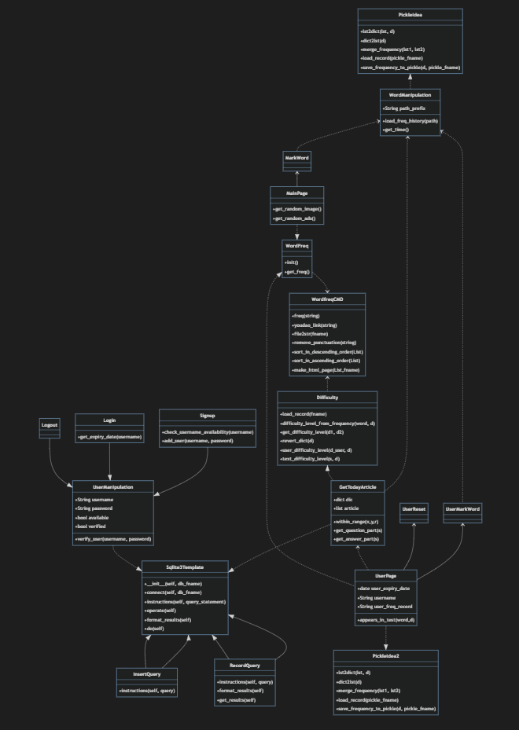

# Lab1：Dependency Analysis and Dependency Graph

---

小组成员信息：<br/>
201932110143 王炫<br/>
201932110145 邬程峰<br/>
201932110146 吴彬宇<br/>
201932110147 吴雨桐<br/>
201932110148 谢铭轩<br/>

项目Gitee地址：[Gitee](https://gitee.com/dearxuan/EnglishPal.git)

项目Read the Docs地址：[Read the Docs]()

---

## Abstract

借助工具研究EnglishPal现有的模块(或类)之间的依赖关系，了解EnglishPal的架构目前的健康水平，并对当前的架构进行优缺点分析。

## Introduction

EnglishPal是一款面向希望提升自身英语阅读能力的用户，提供英语文章学习服务的轻量级在线网站。它内设了多达百篇不同难度等级的文章，会根据用户的英语水平为用户提供相应难度的文章进行练习；同时，每一个用户还享有独立的生词本，用户可以将在阅读文章过程中遇到的生词收集起来，在复习中进行针对性记忆。

本次实验的目的是通过模块和类及函数两个层面对该项目进行依赖分析，判断模块间、类间的耦合程度以及整体架构的健康水平，为之后的系统维护作准备。

## Materials and Methods

### Materials

1. Snakefood3: 一款使用AST解析python文件并生成依赖关系图的轻量级软件
2. Graphviz 1.6: 一款将结构信息图形可视化的开源软件
3. Mermaid: 一个将文本和代码转化为图表形式，并实现图表动态地创建修改的工具


### Methods

1. 利用snakefood3自动生成EnglishPal的模块层间的依赖关系
2. 利用Graphviz，将snakefood生成的文件转化为图表形式可视化呈现
3. 阅读源码，总结出EnglishPal中类及函数之间的依赖关系，再利用Mermaid生成可视化图表


### Results

模块层

snakefood.dot

```
# This file was generated by snakefood3.

strict digraph "dependencies" {
    graph [
            rankdir="LR",
            overlap="scale",
            ratio="fill",
            fontsize="16",
            dpi="150",
            clusterrank="local"
        ]
    
       node [
            fontsize=14
            shape=ellipse
            fontname=Consolas
       ];

"difficulty.py"  [style=filled];
"difficulty.py" -> "wordfreqCMD.py";
"difficulty.py" -> "math";
"difficulty.py" -> "pickle.py";
"main.py"  [style=filled];
"main.py" -> "UseSqlite.py";
"main.py" -> "WordFreq.py";
"main.py" -> "difficulty.py";
"main.py" -> "pickle_idea.py";
"main.py" -> "pickle_idea2.py";
"main.py" -> "wordfreqCMD.py";
"main.py" -> "datetime";
"main.py" -> "glob.py";
"main.py" -> "os.py";
"main.py" -> "random.py";
"pickle_idea.py"  [style=filled];
"pickle_idea.py" -> "pickle.py";
"pickle_idea2.py"  [style=filled];
"pickle_idea2.py" -> "datetime";
"pickle_idea2.py" -> "pickle.py";
"UseSqlite.py"  [style=filled];
"UseSqlite.py" -> "sqlite3";
"WordFreq.py"  [style=filled];
"WordFreq.py" -> "wordfreqCMD.py";
"WordFreq.py" -> "string.py";
"wordfreqCMD.py"  [style=filled];
"wordfreqCMD.py" -> "pickle_idea.py";
"wordfreqCMD.py" -> "collections.py";
"wordfreqCMD.py" -> "operator";
"wordfreqCMD.py" -> "os.py";
"wordfreqCMD.py" -> "string.py";
"wordfreqCMD.py" -> "sys";
}

```

依赖图（graphviz生成）


类/函数层
metmaid.txt

```
mermaid
classDiagram
    WordFreq ..> WordfreqCMD
    WordfreqCMD <.. Difficulty
    Sqlite3Template <|-- InsertQuery
    Sqlite3Template <|-- RecordQuery
    WordManipulation <.. GetTodayArticle
    GetTodayArticle ..|>Sqlite3Template
    Difficulty <|.. GetTodayArticle
    MainPage ..|> WordFreq
    WordManipulation <.. MarkWord
    PickleIdea <|.. WordManipulation
    MarkWord <-- MainPage
    UserMarkWord <-- UserPage
    UserReset <-- UserPage
    GetTodayArticle <.. UserPage
    UserPage ..|> PickleIdea2
    WordFreq <|.. UserPage
    WordManipulation <.. UserMarkWord
    Signup --|> UserManipulation
    Login  --|> UserManipulation
    Logout  --|> UserManipulation
    UserManipulation ..|>Sqlite3Template
    Sqlite3Template <|-- InsertQuery
    Sqlite3Template <|-- RecordQuery
    class PickleIdea{
       +lst2dict(lst, d)
       +dict2lst(d)
       +merge_frequency(lst1, lst2)
       +load_record(pickle_fname)
       +save_frequency_to_pickle(d, pickle_fname)
    }
    class PickleIdea2{
       +lst2dict(lst, d)
       +dict2lst(d)
       +merge_frequency(lst1, lst2)
       +load_record(pickle_fname)
       +save_frequency_to_pickle(d, pickle_fname)
    }

    class WordfreqCMD{
      +freq(string)
      +youdao_link(string)
      +file2str(fname)
      +remove_punctuation(string)
      +sort_in_descending_order(List)
      +sort_in_ascending_order(List)
      +make_html_page (List,fname)
    }
    class WordFreq{
      +init()
      +get_freq()
    }
    class Difficulty{
      +load_record(fname)
      +difficulty_level_from_frequency(word, d)
      +get_difficulty_level(d1, d2)
      +revert_dict(d)
      +user_difficulty_level(d_user, d)
      +text_difficulty_level(s, d)
    }
    class WordManipulation{
      +String path_prefix
      +load_freq_history(path)
      +get_time()
    }
    class GetTodayArticle{
      +dict dic
      +list article
      +within_range(x,y,r)
      +get_question_part(s)
      +get_answer_part(s)
    }
    class MainPage{
    +get_random_image()
    +get_random_ads()
    }
    class MarkWord{
    }
    class UserPage{
    +date user_expiry_date
    +String username
    +String user_freq_record
    +appears_in_test(word,d)
    }
    class UserReset{
    }
    class UserMarkWord{
    }
    class UserManipulation{
    +String username
    +String password
    +bool available
    +bool verified
    +verify_user(username, password)
    }
    class Signup{
    +check_username_availability(username)
    +add_user(username, password)
    }
    class Login{
    +get_expiry_date(username)
    }
    class Logout{
    }
    class Sqlite3Template{
       +__init__(self, db_fname)
       +connect(self, db_fname)
       +instructions(self, query_statement)
       +operate(self):
       +format_results(self)
       +do(self)
    }
    class InsertQuery{
      +instructions(self, query)
    }
    class RecordQuery{
      +instructions(self, query)
      +format_results(self)
      +get_results(self)
}
```

依赖图（Mermaid生成）



## Discussions

### 依赖分析


### 当前架构优缺点

#### 优点：

1.使用了Flask框架，让项目变得精简、易于

前后端

#### 缺点：

### 总结

## References

[1] [Sofia Peterson, How to Write a Computer Science Lab Report, Copyright (C) 2019](https://thehackpost.com/a-brief-guide-how-to-write-a-computer-science-lab-report.html)